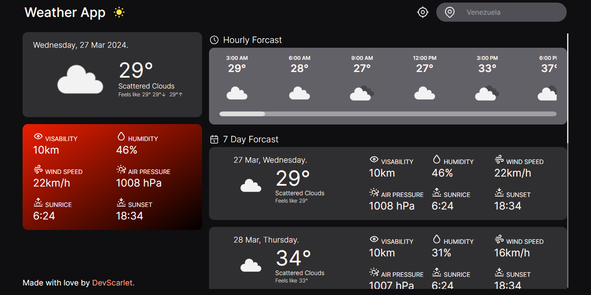

# Weather App ☀️

Esta es una aplicación de pronóstico del tiempo desarrollada por [DevScarlet](https://www.linkedin.com/in/scarletvargas-systems-engineer).

---

## Descripción

WeatherApp es una aplicación de clima que te permite obtener información detallada sobre el clima actual y pronósticos extendidos para cualquier ubicación del mundo. Con una interfaz intuitiva y fácil de usar, WeatherApp te mantiene informado sobre las condiciones climáticas en tiempo real y te ayuda a planificar tus actividades al aire libre.

---

## Uso

1. En la página de inicio, puedes buscar una ciudad específica en el cuadro de búsqueda o hacer clic en el ícono de ubicación actual para obtener el clima basado en tu ubicación.
2. Selecciona una de las sugerencias de la lista desplegable o presiona Enter para realizar la búsqueda.
3. Una vez que se carguen los datos, podrás ver el clima actual y el pronóstico extendido para esa ubicación.

---

## Enlaces Útiles

[Weather App](https://weather-app-zeta-three-53.vercel.app/)

---

## Tecnologías Utilizadas

- [React](https://reactjs.org/) Utilizado para el desarrollo del frontend.
- [Next.js](https://nextjs.org/) Empleado para el enrutamiento y la renderización del lado del servidor.
- [TypeScript](https://www.typescriptlang.org/) Utilizado para la tipificación estática del código.
- [Tailwind CSS](https://tailwindcss.com/) Empleado para el diseño y estilización de la interfaz de usuario.
- [axios](https://axios-http.com/) Utilizado para realizar solicitudes HTTP.
- [date-fns](https://date-fns.org/) Empleado para el manejo y formateo de fechas.
- [jotai](https://github.com/pmndrs/jotai) Utilizado para la gestión del estado.
- [react-query](https://react-query.tanstack.com/) Empleado para el manejo de datos y caché.
- [next-themes](https://github.com/pacocoursey/next-themes) Utilizado para agregar soporte de temas a Next.js.
- [clsx](https://github.com/lukeed/clsx) Empleado para generar listas de clases de manera condicional.
- [tailwind-merge](https://github.com/benface/tailwind-merge) Utilizado para combinar múltiples clases de Tailwind CSS.
API de OpenWeatherMap para obtener datos meteorológicos en tiempo real.
API de Geolocation para la obtención de coordenadas geográficas del usuario.

---

## Contacto

Si tienes alguna pregunta o sugerencia, no dudes en ponerte en contacto conmigo a través de mi perfil de GitHub o mi cuenta en LinkedIn.

---